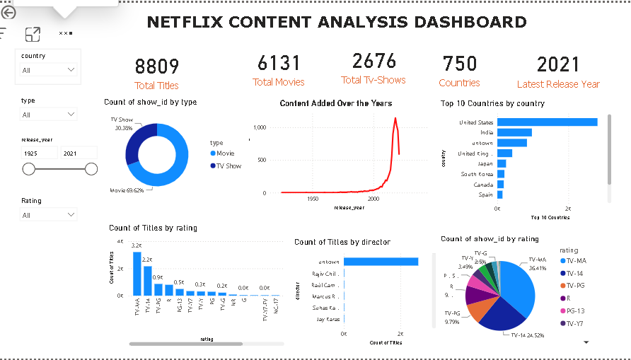
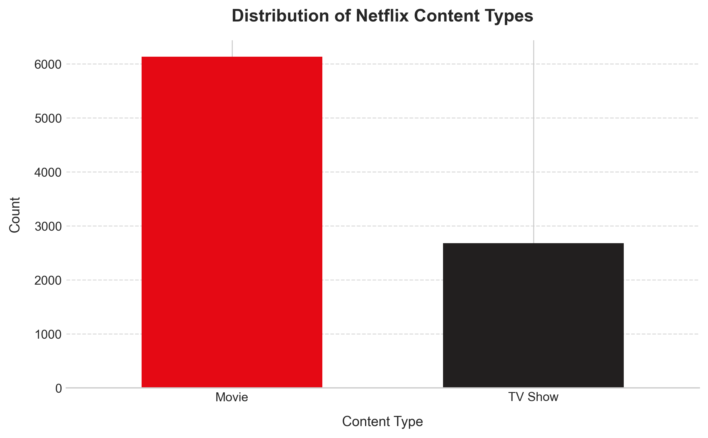
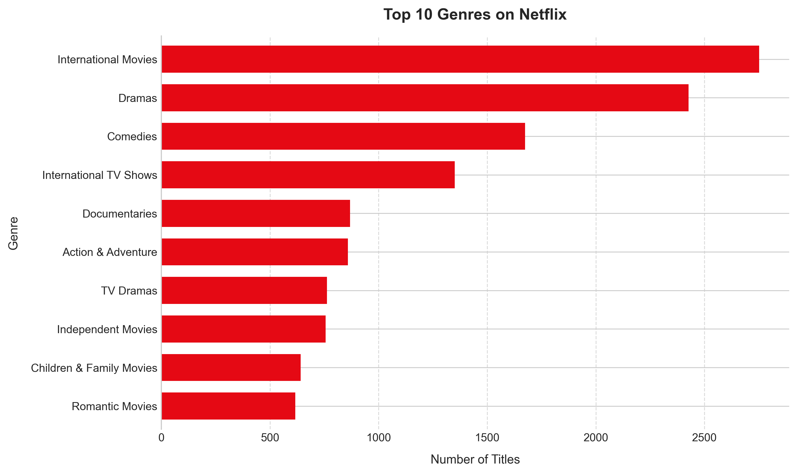
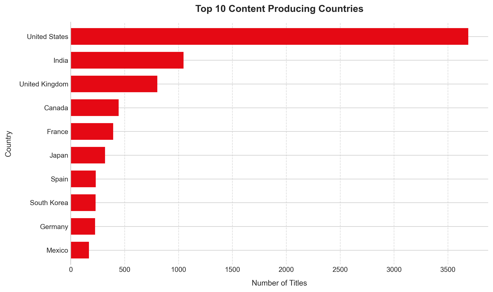
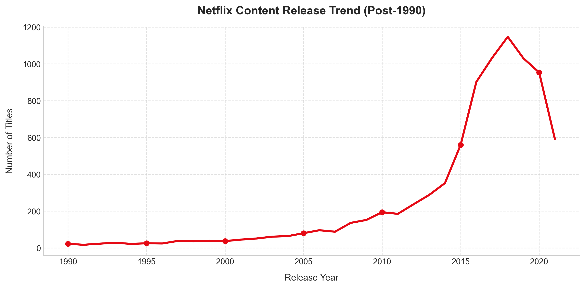
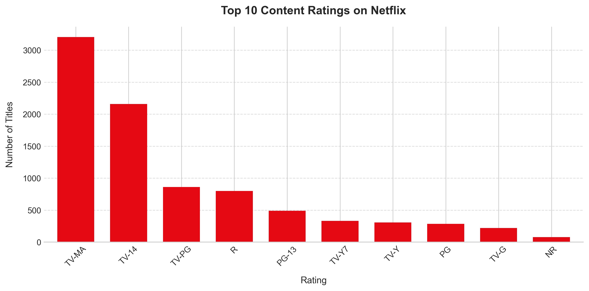
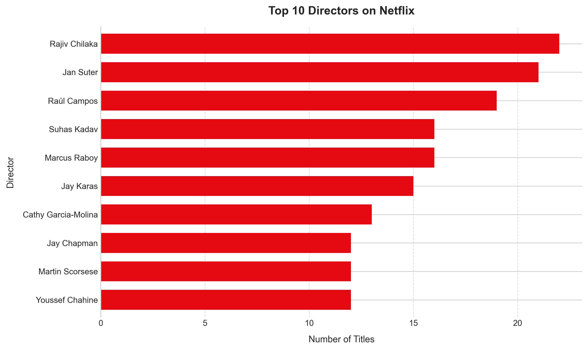

# Netflix Content Analysis

## Project Overview
This project provides a comprehensive analysis of the Netflix catalog, exploring trends in movies and TV shows, distribution across genres, content ratings, top producing countries, and release timelines. 

## Project Workflow
1. **Data Cleaning**: Handled missing values, formatted dates, and resolved multi-value fields (genres, countries) in Python.
2. **Database Querying**: Created tables and performed aggregation queries in MySQL.
3. **Exploratory Data Analysis (EDA)**: Structured data visualizations using Matplotlib in Python.
4. **Data Visualization**: Built an interactive dashboard in Power BI.

---

## Power BI Dashboard
Below is the preview of the interactive Power BI dashboard created for this analysis:

---

## Key Analysis & Visualizations

### 1. Movies vs TV Shows Distribution
Movies represent approximately 70% of the titles on Netflix, while TV shows make up the remaining 30%.

### 2. Top 10 Genres
International movies, dramas, and comedies dominate the platform's library.

### 3. Top 10 Content Producing Countries
The United States is the leading content producer on Netflix, followed by India and the United Kingdom.

### 4. Catalog Growth Trend
Netflix content production grew rapidly post-2015, peaking around 2018-2019.

### 5. Content Rating Distribution
The majority of Netflix content is rated TV-MA (Mature Audience) and TV-14 (Parents Strongly Cautioned), indicating a catalog focus on mature audiences.

### 6. Top 10 Directors
Rajiv Chilaka leads the dataset in directed titles (primarily children's animation), followed by Jan Suter and Raul Campos.

---

## Key Findings
- **Format Focus**: Movies outnumber TV shows 2.3 to 1 in the catalog.
- **Mature Content Dominance**: Mature content (TV-MA/TV-14/R) represents the largest share of the platform's library.
- **Geographic Concentration**: Content production is heavily concentrated in the US, India, and the UK, which combined produce more than half of the total library content.
- **Catalog Age**: The platform focuses heavily on modern releases (average release year is 2014), with limited vintage titles.
